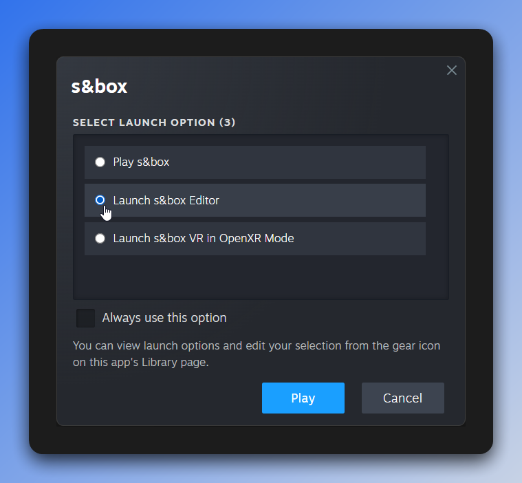

## s&box beginner tutorials - chapter 0

Welcome to the introductory chapter of the s&box beginner tutorials!

This tutorial series may be for you if:
- You are brand new to s&box
- You want to learn how to make games
- You are interested in what s&box is capable of

If you are already an experienced game developer and familiar with s&box, we recommend skipping ahead.

### Setup

For each chapter, you can open the corresponding folder in the [sbox-council/tutorials repo](https://github.com/sbox-council/tutorials). 
We recommend cloning the entire project - each chapter has its own project to use as a starting point. If you follow along the tutorials
from start to finish, you should be able to simply build off your previous work when moving to the next chapter.

#### Install Prerequisites
- Install the latest version of [Visual Studio](https://visualstudio.microsoft.com/downloads/), and the .NET 9 SDK.
    - See [Setting up Visual Studio](https://wiki.facepunch.com/sbox/Setting_up_Visual_Studio).
    - You're welcome to use another IDE (such as Rider or VS Code) if you already have a preference.
- Install s&box on Steam (see [sbox.game](https://sbox.game/give-me-that) if you do not already have the game).
- Join the [s&box discord](https://discord.gg/sbox) in case you have any questions about the tutorials. There are always people happy to help in the #beginners channel!

### Starting the s&box editor

To start, press Play on s&box in Steam. It'll open up a prompt. Select Launch s&box Editor as shown in the screenshot below.

After a little while, the project launcher window should appear. From here, select the **Add a project from a folder** button.
This option will open the file explorer, and allow you to select the `tutorial_0.sbproj` file located within the tutorial_0 folder.

After adding the tutorial_0 project, it should appear in your Local Projects in the launcher. Click it to open the s&box editor for this project.